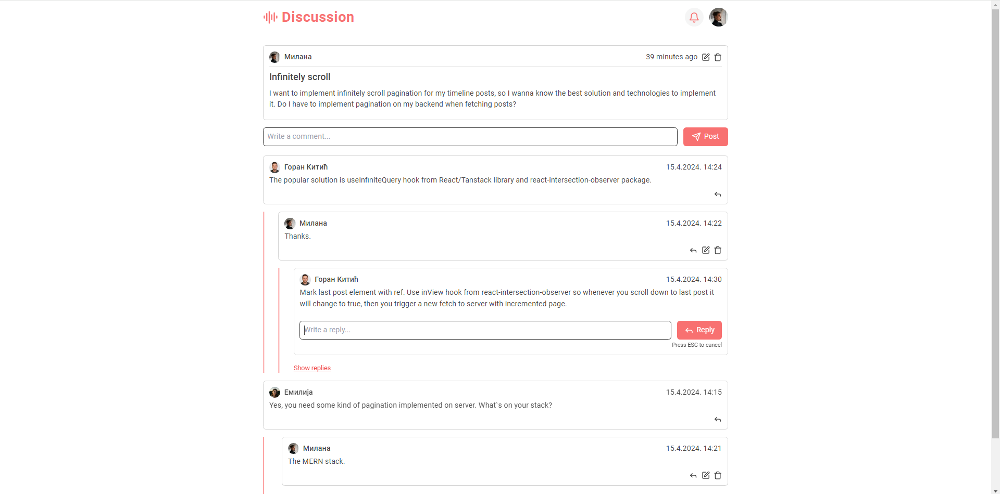
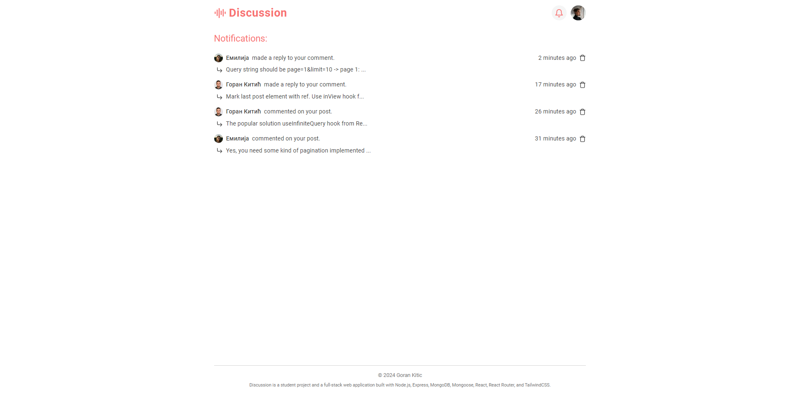

# Discussion

Discussion is a student project and a simple full-stack application where users can create questions and have discussions with other users creating comments and replies.

Practicing: 
  - Fetching data
  - Error handling
  - Handling global state with context api
  - Creating custom hooks

©️ 2024 Goran Kitic

