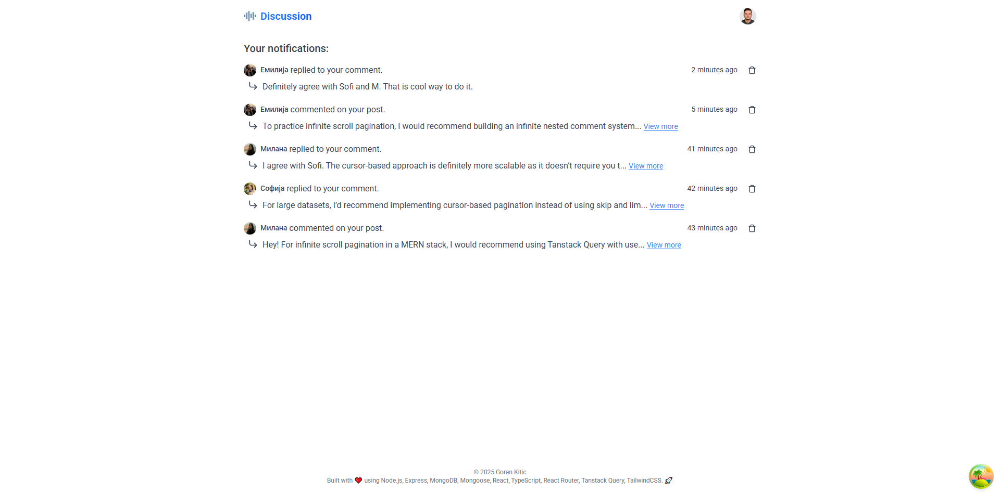

# 💭 Discussion

Discussion is a full-stack student project developed while learning Node.js, Express, MongoDB, Mongoose, React, TypeScript, React Router, Tanstack Query, and TailwindCSS. The application is inspired by web platforms like Reddit and HackerNews.

⌨️ Key Features:

-   Infinite Scroll Pagination: Implemented to handle large sets of posts or comments efficiently.

-   Infinite Nested Comment System: Inspired by Reddit’s threading system, allowing users to reply to comments, creating an engaging discussion thread.

-   MongoDB Transactions & Aggregation Pipeline: Practicing MongoDB's powerful features to enhance data management and query capabilities.

👨‍🚀 User Features:

-   User Registration: Sign up with email verification.

-   Password Management: Reset and update passwords.

-   Post Creation: Users can create, update, or delete posts and comments.

-   Comment Interaction: Upvote comments to highlight popular content.

©️ 2025 Goran Kitic





# 🚀 How to use the project

Follow these steps to get the project up and running locally:

1. Clone the Repository
2. Install Dependencies for both frontend and backend
3. Add .env variables for frontend (/frontend/.env)

```
VITE_API_URL=example http://localhost:3000

VITE_SUPABASE_URL=example
VITE_SUPABASE_ANON_KEY=example
```

4. Add .env variables for backend (/backend/.env)

```
NODE_ENV=development
PORT=example 3000

APP_ORIGIN=example http://localhost:5173

MONGO_URI=example

JWT_ACCESS_SECRET=example
JWT_ACCESS_EXPIRES_IN=example

EMAIL_USERNAME=example
EMAIL_PASSWORD=example
EMAIL_HOST=example
EMAIL_PORT=example
```
